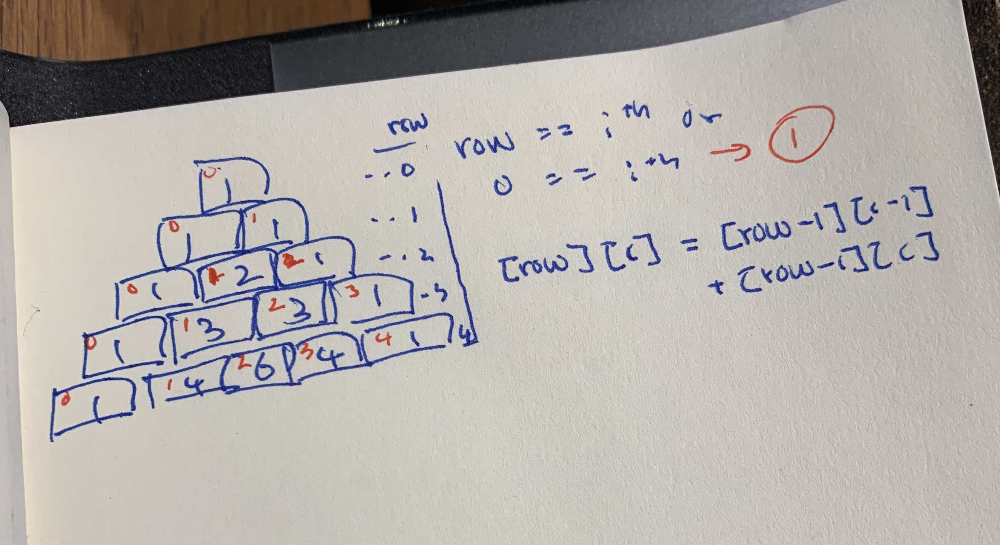

# 118. Pascal's Triangle

https://leetcode.com/problems/pascals-triangle

## TypeScript

### Approach



- 첫 번째와 마지막 원소의 값은 항상 `1`
- 중간 값 계산식: `arr[row][col] = arr[row-1][col-1] + arr[row-1][col]`

### Code

```ts
function generate(r: number): number[][] {
  let arr: number[][] = new Array(r);
  for (let i = 0; i < r; ++i) {
    arr[i] = [];
  }

  for (let row = 0; row < r; ++row) {
    for (let col = 0; col <= row; ++col) {
      if (0 === col || row === col) {
        arr[row].push(1);
      } else {
        arr[row].push(arr[row - 1][col - 1] + arr[row - 1][col]);
      }
    }
  }

  return arr;
}
```

### 시간복잡도

안쪽 루프를 `1, 2, 3, ..., n-1, n` 번 순회하기 때문에 결과적으로 $O(n^2)$의 시간복잡도를 가지게된다.

### 공간복잡도

`n*(n+1)/2`개의 공간을 새로 만들기 때문에 공간복잡도는 $O(N^2)$가 된다.
