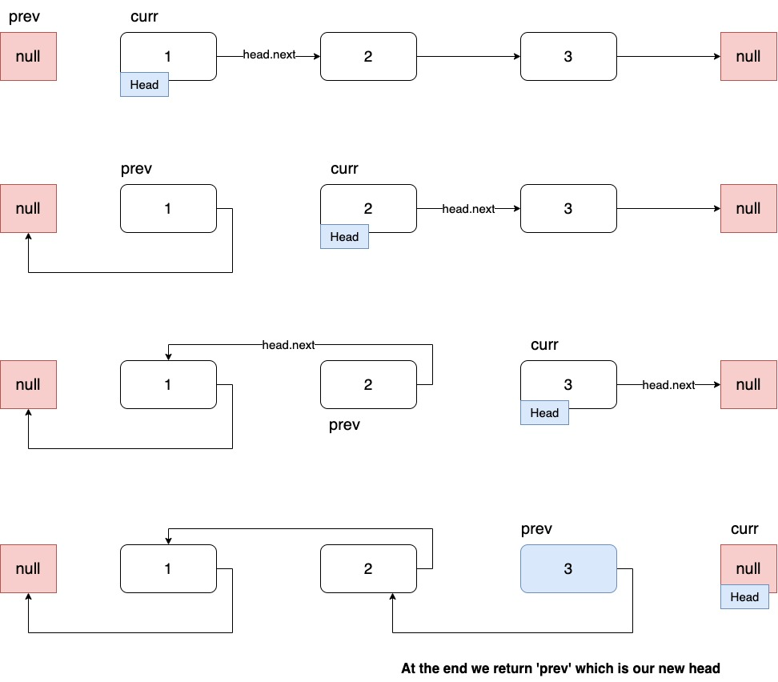

# 206. Reverse Linked List

https://leetcode.com/problems/reverse-linked-list/

## Approach

반복문 사용을 사용한 방법. 아래와 같은 과정이 된다.



## TypeScript

### Iterative

```ts
function reverseList(head: ListNode | null): ListNode | null {
  if (!head || null === head.next) return head;

  let prev: ListNode = null;
  let temp: ListNode = null;

  while (head) {
    temp = head.next;
    head.next = prev;
    prev = head;
    head = temp;
  }

  return prev;
}
```

### ES6 code

찾아보니 JS는 아래처럼 destructuring을 사용해서 간단히 가능하네요.
ref: [@roy6234leetcode](https://leetcode.com/problems/reverse-linked-list/discuss/869957/Javascript-Iterative-and-Recursive-solution)

```ts
var reverseList = function (head) {
  let [prev, current] = [null, head];
  while (current) {
    [current.next, prev, current] = [prev, current, current.next];
  }
  return prev;
};
```

### Recursive

[reverseRecur](https://github.com/rolemadelen/typescript-algorithms/blob/main/src/data-structures/linked-list/LinkedList.ts)
여기에서 구현한 `reverseRecur` 함수를 확인해보면 코드가 살짝 다르다. 연결리스트 클래스를 직접 만들었고 `this.head`에 접근할 수 있다보니,
재귀 자체에서 뭘 반환하든 상관이 없지만,, 이 문제에서는 반환되는 노드가 `head`가 된다. 그래서 새로운 head를 계속 기억하고 있어야 한다.

ref: [@roy6234leetcode](https://leetcode.com/problems/reverse-linked-list/discuss/869957/Javascript-Iterative-and-Recursive-solution)

```ts
var reverseList = function (head) {
  if (head == null || head.next == null) {
    return head;
  }

  // 뒤에서 부터 노드를 가져온다
  let reversedListHead = reverseList(head.next);

  // 1 -> 2 -> 3 -> ø
  //      H   R
  // 1 -> 2-> 3 -> 2   원형 (2-3-2)
  head.next.next = head;
  // 1 -> 2 -> ø
  // ø <- 2 <- 3 (reverse)
  head.next = null;

  // 돌아가서 (한 칸 왼쪽 노드로 이동한 것) 반복하면 끝.
  // reversedListHead는 계속 마지막 노드를 가리킴
  return reversedListHead;
};
```

### Complexity

시간 복잡도는 어떤 방법을 사용하든지 **O(N)**.
다만 재귀를 사용하면 공간 복잡도가 **O(N)**이 되고 반복문을 사용하면 **O(1)**이 된다.
