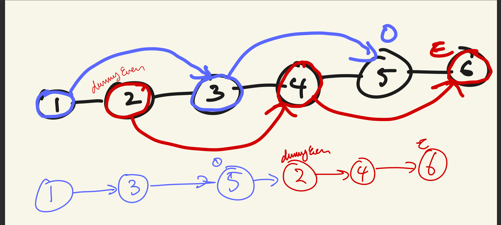

# 0328. Odd Even Linked List
https://leetcode.com/problems/odd-even-linked-list/

## TypeScript

### Approach

홀수와 짝수 노드를 가리킬 `odd`와 `even` 두 개의 포인터를 사용했다.

`odd`부터 순서대로 각 포인터의 다음 노드를 가리킨다: `odd.next = even.next`.
`even` 노드도 마찬가지로 `odd.next`를 가리켜야 하지만 그 전에, `odd`를 다음 노드로 먼저 이동시켜주어야 한다 (아래 그림에서 파란색 3번 노드). 그러면 `even.next = odd.next`를 했을 때 제대로 다음 짝수 번 째 노드를 가리키게 된다.



### Code
```ts
function oddEvenList(head: ListNode | null): ListNode | null {
    if(!head) return null;
    if(head.next === null) return head;
    let odd = head;
    let dummyEven = head.next;
    let even = dummyEven;
    
    while(odd && even) {
        if(even.next == null) break;
        odd.next = even.next;
        odd = odd.next;
        if(!odd) break;
        even.next = odd.next;
        even = even.next;
        if(!even) break;
    }
    
    odd.next = dummyEven;
    
    return head;
};
```

### Complexity
짝수와 홀수 각각 리스트 반씩 (즉 리스트 전부) 한 번씩 순회하므로 시간 복잡도는 `O(N)`이 된다.

따로 리스트를 만들거나 배열을 만들어 값을 저장하지 않았기 때문에 공간 복잡도는 `O(1)`이다.