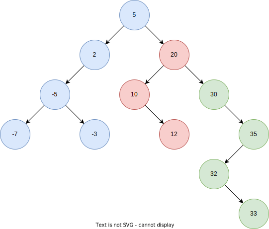

## Binary Search Tree



## Pseudocode for Basic Implementations

### Insert

```text
insert(root, value) -> void
  Pre: root is the root node of the tree
       value is the value we're going to insert into the tree
  Post: A new node is inserted to the tree maintaining the BST property

  n ← new Node(value)

  IF root == ø
    root ← n
  ELSE
    temp ← root

    WHILE temp != ø
      IF value < temp.value
        IF curr.left == ø
          curr.left ← n
          BREAK;
        END IF

        curr = curr.left
      ELSE
        IF curr.right == ø
          curr.right ← n
          BREAK;
        END IF

        curr = curr.right
      END IF
    END WHILE
  END IF
END
```

- 시간 복잡도:
  + 최악의 경우 skewed tree를 생각해보면 된다. 이 경우 단순히 연결리스트와 같기 때문에 **O(n)**이 된다. 단순하게 트리의 높이 (height)이라고 생각하면 된다 → **O(h)**
